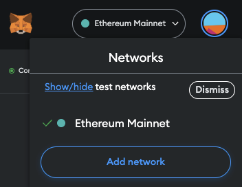
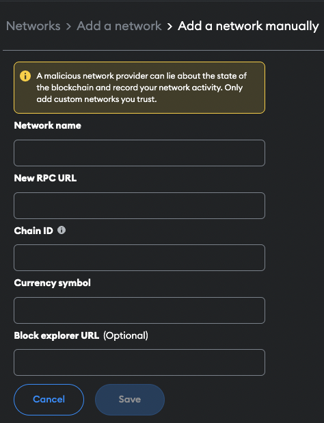

# Add nume network
This tutorial assumes you have already downloaded a web3 wallet like MetaMask. You'll also need a chain's native currency to transact. If you're using a testnet, you can get some from a [faucet](https://faucet.polygon.technology/). If you're using a mainnet, you'll need to buy some from an exchange.

To start using the Nume bridge, you need to add the desired chain's RPC endpoint to your wallet. Here, we provide an example for doing this using the MetaMask wallet. You need to first click on the MetaMask extension on your browser, click MetaMask's network selector dropdown, and then click the Add Network button. Click "Add a network manually" and then provide the information corresponding the the Nume chain you want to connect to:

**Nume Polygon testnet** :
- Network Name: Nume mumbai
- New RPC URL: https://dev.rpc.numecrypto.com
- Chain ID: 710
- Currency Symbol: MATIC
- Block Explorer URL: https://dev.explorer.numecrypto.com

<!-- **Nume Polygon mainnet** :
- Network Name: Nume
- New RPC URL: https://rpc.numecrypto.com
- Chain ID: 711
- Currency Symbol: MATIC
- Block Explorer URL: https://explorer.numecrypto.com -->
