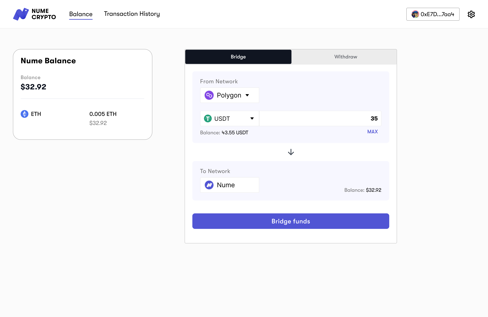

# Deposit from zkEVM to Nume

To move your tokens to the Nume chain, visit [bridge.numecrypto.com](https://bridge.numecrypto.com) Login to the bridge with your wallet and make sure you are connected to the Polygon zkEVM network.

Select the token you want to bridge in the token drop-down menu.

Enter the amount of tokens you want to bridge over in the field and then press bridge funds. Follow the prompts on MetaMask.
Please make sure you leave enough ETH in your wallet to pay for the transaction, otherwise, wallet will show an error.

After you submit the transaction through MetaMask you can expect your funds to arrive on Nume One within roughly 1 minute to an hour (depending on the chain congestion).
Also, make sure your MetaMask wallet is set to nume network so you can see your funds when they arrive.
