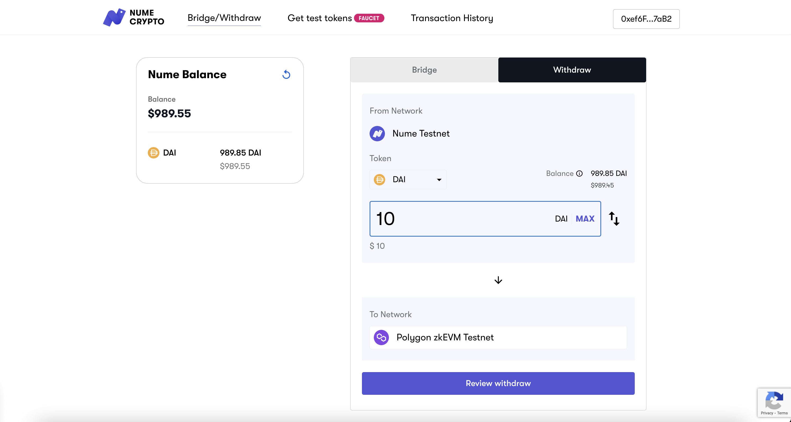

# Withdraw from Nume to zkEVM
To move your funds back to Polygon Mainnet, your need to be logged in to the Nume bridge with your wallet and make sure you are connected to the Nume network.

Select the token you want to bridge in the token drop-down menu.

Enter the amount of tokens you want to withdraw in the field and then press withdraw funds. Follow the prompts on MetaMask.

After you submit the transaction through MetaMask you can expect your funds to arrive on Polygon mainnet within roughly 1hour (depending on when the settlement is processed).

