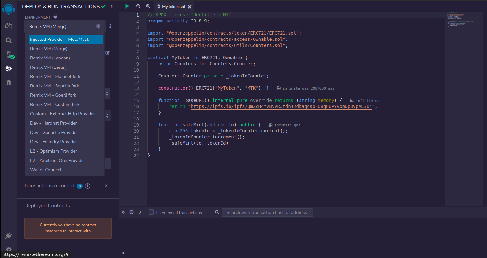
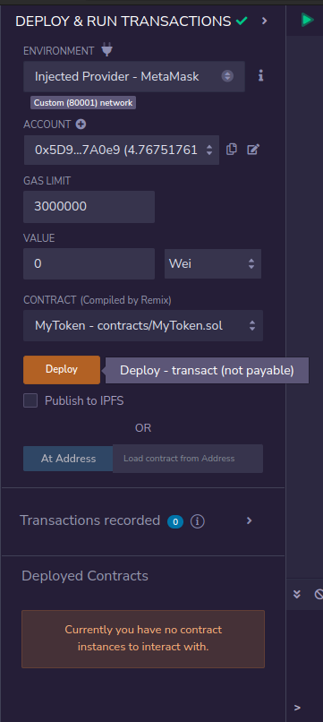
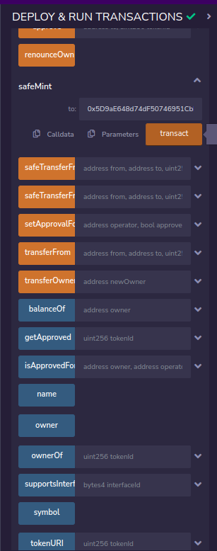

# NFT minting tutorial

In this tutorial we will create an NFT collection and mint NFTs on Nume. Basic knowledge of javascript is sufficient to complete this tutorial. You need nodejs installed on your machine and use any of your favourite code editor.

While creating the metadata urls for the NFTs, we recommend you to follow this format `baseuri/tokenid`, so that every NFT that is being minted will have the unique metadata url to avoid duplicates and cunfusion between token ids on Nume and on L1.

> Example

Let us consider this as our base uri for the NFT collection `https://ipfs.io/ipfs/QmZcH4YvBVVRJtdn4RdbaqgspFU8gH6P9vomDpBVpAL3u4`

Then metadata url for the NFT with token id 1 should be `https://ipfs.io/ipfs/QmZcH4YvBVVRJtdn4RdbaqgspFU8gH6P9vomDpBVpAL3u4/1`

Currently token id of NFT is handled by Nume, so following this format will make NFT collection creation and NFT minting process smooth.

# Deploy a sample ERC721 (NFT) contract on L1

If you are familiar to NFT contract development, feel free to create your own contract and deploy using any tool/framework. To keep things simple for this tutorial we will create a NFT contract with minimal functions and use remix to deploy it on polygon mumbai.

- remix - it is a browser based smart contract developemnt environment
- polygon mumbai - we will deploy the contract on mumbai testnet, get some test matic from any faucet to deploy the collection and mint some NFTs

```sol
// SPDX-License-Identifier: MIT
pragma solidity ^0.8.9;

import "@openzeppelin/contracts/token/ERC721/ERC721.sol";
import "@openzeppelin/contracts/access/Ownable.sol";
import "@openzeppelin/contracts/utils/Counters.sol";

contract MyToken is ERC721, Ownable {
    using Counters for Counters.Counter;

    Counters.Counter private _tokenIdCounter;

    constructor() ERC721("MyToken", "MTK") {}

    function _baseURI() internal pure override returns (string memory) {
        return "https://ipfs.io/ipfs/QmZcH4YvBVVRJtdn4RdbaqgspFU8gH6P9vomDpBVpAL3u4";
    }

    function safeMint(address to) public {
        uint256 tokenId = _tokenIdCounter.current();
        _tokenIdCounter.increment();
        _safeMint(to, tokenId);
    }
}
```

Connect metmask on remix



Click on deploy to initiate contract creation transaction



Put the recipient address of the NFT and click on transact button of safeMint to mint the NFT



You can verify all these transactions using polygonscan.

- Create a new folder for this project

```sh
mkdir numeNFTCollection
cd numeNFTCollection
```

- Create a javascript file (index.js)

# NFT collection creation

Make an API request to create an NFT (Non-Fungible Token) collection using the Numecrypto API.

```js
const url = "http://api.numecrypto.com/v2/create-nft-collection";
const apiKey = "NUME-API-KEY";

function callAPI(url, apiKey, data) {
  return fetch(url, {
    method: "POST",
    headers: {
      "Content-Type": "application/json",
      "NUME-API-KEY": apiKey,
    },
    body: JSON.stringify(data),
  })
    .then((response) => response.json())
    .then((data) => {
      console.log("API response:", data);
      return data;
    })
    .catch((error) => console.error("API error:", error));
}

const requestData = {
  name: "", // name of the NFT collection
  owner: "", // owner address of the collection
  contractAddress: "", // contract address of the collection on L1
  mintUsers: [""], // array of addresses that can mint NFTs from collection on Nume
  lastTokenId: 0, // last minted token id on l1 (token id continuation will be done to avoid confusion)
  baseUri: "", // base uri of the collection (will be used for metadata of NFTs)
};

callAPI(url, apiKey, requestData).then((responseData) => {
  // Do something with the response data here
});
```

**Response**

Status code 200 will be returned for successful creation of NFT collection.

```json
{
  "message": "success",
  "statusCode": 200
}
```

---

# NFT minting

Make an API request to mint an NFT (Non-Fungible Token) using the Numecrypto API.

```js
const url = "http://api.numecrypto.com/v2/mint-nft";
const apiKey = "NUME-API-KEY";

function callAPI(url, apiKey, data) {
  return fetch(url, {
    method: "POST",
    headers: {
      "Content-Type": "application/json",
      "NUME-API-KEY": apiKey,
    },
    body: JSON.stringify(data),
  })
    .then((response) => response.json())
    .then((data) => {
      console.log("API response:", data);
      return data;
    })
    .catch((error) => console.error("API error:", error));
}

const data = {
  contractAddress: "", // contract address of the NFT collection
  MintUser: "", // recipient address to which the NFT to be minted
};

callAPI(url, apiKey, data)
  .then((response) => {
    console.log(response);
    // Do something with the response here
  })
  .catch((error) => console.error(error));
```

**Response**

Status code 200 will be returned for successful minting of NFT and a message object containing contract address, recipient address and token id of the NFT minted. Token id will be auto incremented continuing the last token id from its corresponding L1. And every NFT will have the metadata url in `baseuri/tokenid` format.

```json
{
  "message": {
    "ContractAddress": "",
    "MintUser": "",
    "NftTokenId": 0
  },
  "statusCode": 200
}
```

- Run the javascript file

```sh
node ./index.js
```
